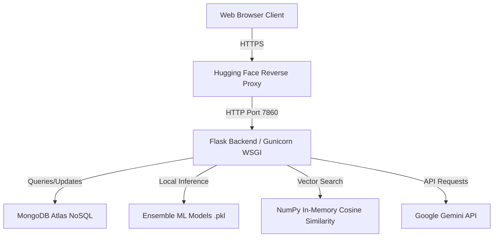
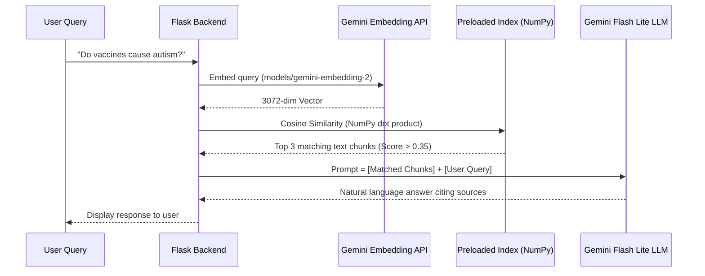

# AutiScan Viva Technical Prep Guide

This document is your technical cheat sheet for your Viva. It breaks down every component of **AutiScan** with the exact engineering concepts, math, and code mechanisms so you can confidently answer any question from the external examiner.

---

## 1. High-Level System Architecture

AutiScan is an AI-powered early autism screening and digital therapy web application.



### Technology Stack:
1. **Frontend**: HTML5, CSS3, JavaScript (Vanilla), and Bootstrap. Responsive design for mobile/desktop.
2. **Backend**: **Flask** (Python-based micro-framework) run in production using **Gunicorn** (Green Unicorn - a WSGI HTTP server).
3. **Database**: **MongoDB Atlas** (Cloud-hosted NoSQL Document Database) using the `pymongo` driver.
4. **Machine Learning Pipeline**: `scikit-learn` for training and inference, `pickle` for model serialization.
5. **Explainable AI (XAI)**: `shap` (SHapley Additive exPlanations) for model transparency.
6. **Generative AI & RAG**: Google Generative AI API (`models/gemini-embedding-2` for vector embeddings, `gemini-flash-lite-latest` for natural language generation).
7. **Hosting Platform**: **Hugging Face Spaces** deploying a custom **Docker container** (`Dockerfile` based on `python:3.12-slim`).

---

## 2. Machine Learning Pipeline (Risk Screening)

### Dataset (`autism_child_data.csv`)
* The dataset represents screening results containing Q-CHAT-10 / AQ-10 questions.
* **Features (14 inputs)**:
  * `A1_Score` to `A10_Score`: 10 binary behavioral/sensory questionnaire answers (0 = Typical, 1 = Indicative of autistic traits).
  * `age`: Child's age in months.
  * `gender`: Mapped to `1` (Male) or `0` (Female).
  * `jundice`: History of neonatal jaundice mapped to `1` (Yes) or `0` (No).
  * `austim`: Immediate family history of autism mapped to `1` (Yes) or `0` (No).
* **Target variable**: `Class/ASD` mapped to `1` (Yes) or `0` (No).

### The Model: Machine Learning Ensemble
Instead of relying on a single classifier, AutiScan uses a **Voting Ensemble** of three different classification algorithms to improve accuracy and generalization:
1. **Logistic Regression (LR)**:
   * A linear model for binary classification.
   * Standardized features using `StandardScaler` (z-score normalization: $z = \frac{x - \mu}{\sigma}$).
   * Hyperparameter-tuned using `GridSearchCV` over the regularization strength parameter `C` (`[0.1, 1, 10]`).
2. **Multi-layer Perceptron (MLP Neural Network)**:
   * A feedforward artificial neural network.
   * Architecture: Two hidden layers with `32` and `16` neurons respectively.
   * Activation function: `ReLU` (Rectified Linear Unit: $f(x) = \max(0, x)$).
   * Regularization and scaling applied via `Pipeline`.
3. **Random Forest Classifier (RF)**:
   * A non-linear ensemble model composed of `100` decision trees.
   * Leverages bootstrap aggregating (bagging) and feature randomness to prevent overfitting.

### Prediction & Probability Calibration (`app.py` line 914-924)
When a screening form is submitted:
1. The answers are formatted into a DataFrame.
2. The predicted probabilities are extracted from each model using `predict_proba`:
   $$\text{Final Probability} = \frac{P_{\text{LogisticRegression}} + P_{\text{NeuralNetwork}} + P_{\text{RandomForest}}}{3}$$
3. **Calibration**: The probability is clipped between `[0.05, 0.95]` and calibrated towards 50% to prevent extreme 0% or 100% predictions in a soft screening tool:
   $$\text{Calibrated Probability} = 0.5 + (\text{Final Probability} - 0.5) \times 0.6$$
4. The percentage is mapped to a **Risk Spectrum** (Very Low, Low, Moderate, High, Very High).

---

## 3. Explainable AI (XAI) using SHAP

### What is SHAP?
* **SHAP (SHapley Additive exPlanations)** is based on cooperative game theory. 
* It calculates the **Shapley value** for each input feature. A Shapley value measures how much a specific feature (like a questionnaire score or age) pushed the model's prediction *away* from the base value (the average prediction across the training set).

### How it is implemented:
1. AutiScan uses a `shap.TreeExplainer` on the trained **Random Forest** model.
2. When the user gets their screening results, SHAP runs in real-time on their specific answers:
   ```python
   explainer = shap.TreeExplainer(rf_model)
   shap_explanation = explainer(df_input)
   ```
3. The feature names are translated to human-readable text (e.g., `A1_Score` -> "Lack of Eye Contact").
4. The system identifies:
   * **Top Positive Impacts**: The primary behaviors that pushed the risk level *higher* (displayed as risk factors).
   * **Top Negative Impacts**: Behaviors or attributes that pushed the risk level *lower* (protective factors).

---

## 4. The RAG Pipeline (Retrieval-Augmented Generation)

To allow the Aura chatbot to answer questions using local platform knowledge (articles, therapies, FAQ pages), a custom **RAG (Retrieval-Augmented Generation)** system was built.



### 1. Document Indexer (`build_rag_index.py`)
* Parses HTML templates (like `what-is-autism.html`, `causes-of-autism.html`) using a subclassed `HTMLParser`.
* Ignores layout code (`<nav>`, `<header>`, `<footer>`, `<script>`).
* Chunks the main content by headers (`<h1>`, `<h2>`, etc.) so that text is mapped to specific headers.
* Sends these text chunks in batches to the Gemini API (`models/gemini-embedding-2`) to generate **3072-dimensional vector embeddings** (representation of semantic meaning).
* Saves these chunks and vectors to `rag_index.json`.

### 2. In-Memory Vector Search (`app.py` line 633-662)
* **Startup**: `rag_index.json` is loaded. The embedding vectors are converted into a 2D NumPy array.
* **Vector Normalization**: Vectors are pre-normalized to unit length:
  $$\vec{V}_{\text{normalized}} = \frac{\vec{V}}{\|\vec{V}\|}$$
* **Query Time**: When a user messages Aura, the query is embedded:
  1. The query vector is normalized.
  2. The cosine similarity of the query vector against all 67 document chunk vectors is computed via a **dot product**:
     $$\text{Similarities} = \text{Matrix}_{\text{docs}} \cdot \vec{Q}_{\text{normalized}}$$
     *(Since vectors are pre-normalized, the simple dot product is mathematically equivalent to Cosine Similarity, executing in < 1 millisecond).*
  3. The similarity scores are sorted. Chunks with a score $> 0.35$ (up to a maximum of 3) are extracted.
  4. These chunks are injected into Aura's system prompt as verified platform knowledge, directing the LLM to output accurate answers.

---

## 5. Security, OAuth, and Reverse Proxies

### Google OAuth 2.0 (via `Authlib`)
1. User clicks **"Continue with Google"**.
2. Flask backend redirects the browser to Google's OAuth consent screen with a secure `redirect_uri` (`/authorize/google`).
3. Google authenticates the user and redirects back to the Flask backend with an authorization code.
4. Flask exchanges the code for an access token to retrieve user details (Name, Email) securely.

### Crucial Production Fixes for Cloud Deployment
You must be ready to explain the two fixes implemented to make OAuth work on Hugging Face Spaces:
1. **Iframe Breakout (`target="_top"`)**:
   * **Problem**: Hugging Face runs Spaces inside an `<iframe>`. Google OAuth blocks authentication pages inside iframes to prevent clickjacking (using `X-Frame-Options: DENY`).
   * **Solution**: Modified the Google Login button in HTML to use `target="_top"`. This forces the page to reload on the top-level browser window, breaking out of the iframe before directing to Google.
2. **Reverse Proxy Headers (`ProxyFix` Middleware)**:
   * **Problem**: Hugging Face routes external HTTPS requests to Flask's internal port `7860` over plain HTTP. Flask thinks it is running on `http://127.0.0.1:7860`, causing a scheme mismatch error during Authlib's state verification.
   * **Solution**: Applied `ProxyFix` middleware from `werkzeug.middleware.proxy_fix`:
     ```python
     from werkzeug.middleware.proxy_fix import ProxyFix
     app.wsgi_app = ProxyFix(app.wsgi_app, x_proto=1, x_host=1)
     ```
     This tells Flask to trust headers like `X-Forwarded-Proto` and `X-Forwarded-Host` sent by the Hugging Face load balancer, aligning the internal scheme to `https` and resolving the validation crash.

---

## 6. Likely Examiner Questions & Answers (Cheat Sheet)

### Q1: Why did you choose NoSQL (MongoDB) over SQL (MySQL)?
* **Answer**: MongoDB is document-oriented (JSON-based). In AutiScan, children's profiles, assessment histories, and game score logs have highly dynamic schemas (different fields for different games/assessments). MongoDB's flexible schema allows us to store these variable records easily without complex SQL joins, optimizing read/write speeds.

### Q2: What is the benefit of an Ensemble machine learning model?
* **Answer**: An ensemble combines predictions from multiple models (Logistic Regression, MLP Neural Network, and Random Forest). This reduces variance and bias. Individual models can make errors or overfit, but combining linear, non-linear, and neural classifiers through voting/averaging yields a robust, generalized consensus prediction.

### Q3: Why use RAG instead of Fine-Tuning the LLM?
* **Answer**: 
  1. **Cost & Computation**: Fine-tuning requires massive computational resources (GPUs) and training time. RAG requires none.
  2. **No Hallucinations**: Fine-tuned models can still hallucinate answers. RAG guarantees the model only answers using facts retrieved from our curated documents.
  3. **Easy Updates**: If our articles change, we just regenerate the RAG index JSON. There is no need to retrain a model.

### Q4: Why did you choose Gemini Flash Lite over other LLMs?
* **Answer**: `gemini-flash-lite-latest` is optimized for low-latency tasks. It reduced response generation times from over 20 seconds to under 2 seconds while maintaining excellent natural language comprehension, making it ideal for a real-time chatbot on a web server.

### Q5: What is the mathematical concept behind vector embeddings?
* **Answer**: Vector embeddings map text to a high-dimensional continuous vector space (3072 dimensions in our case). Words or paragraphs with similar semantic meanings are placed close to each other in this space. We measure this closeness using **Cosine Similarity**, which calculates the cosine of the angle between the two vectors. If the cosine is close to 1, the texts are highly related.
